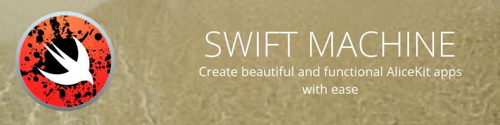

# The Swift Machine


The **Swift Machine** brings AliceKit apps and extensions to life and creates them from rich ideas. This integrated development environment eases the process of making beautiful and functional apps in Swift and put the developer in control, not the other way around.

Yes, we did learn from the mistakes of [Joey Drews's ink machine](https://youtu.be/Y5Cw4iPafoU?t=42s); that's why the Swift Machine is built with AliceKit itself.

## About The Swift Machine
* Current version: 0.1.0
* State: Pre-release
* Requirements:
    * Qlift 0.0.37
    * AliceKit 0.1

## Building
The Swift Machine is a certified AliceKit app and follows the general instructions for setting up and running AliceKit apps.

To build from the source code, run ```sudo swift build```. You can find the executable under ```.build/debug/swift-machine``` to use for a desktop launcher or to run from a terminal.

> Note: For anyone getting started with AliceKit, The Swift Machine aims to be the 'ideal' AliceKit app with proper structures, style guides, and documentation.

## Contributing
Issues are filed under the 'Issues' tab in GitHub. For other projects regarding the development of The Swift Machine, be sure to check the official Project Board on the Artemis Project organization page.

[Visit the Swift Machine dashboard](https://github.com/orgs/artemis-project/projects/2)

This app also helps contribute to the Qlift project by addressing new items and issues, therefore creating a better experience for programming Qt apps in Swift. You can learn more about the Qlift project on the [GitHub repository](http://www.github.com/Longhanks/qlift).

[](https://github.com/artemis-project/alicekit/wiki)